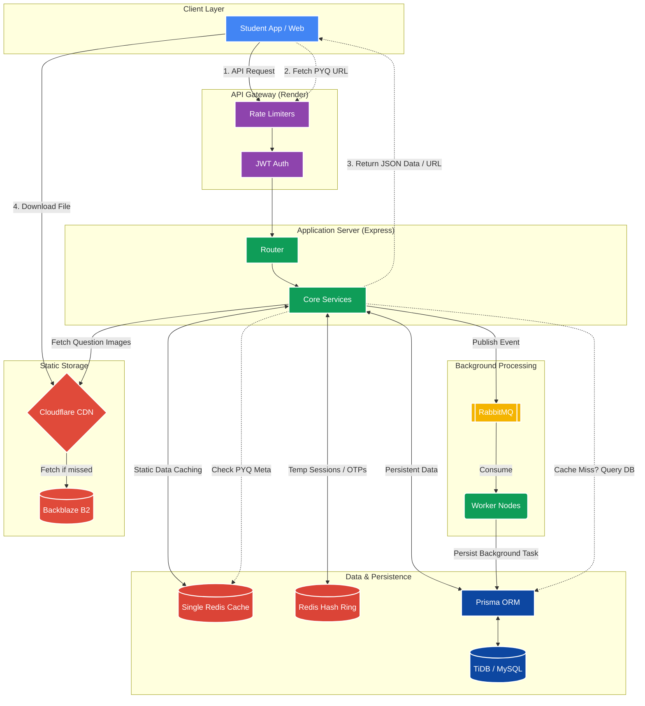
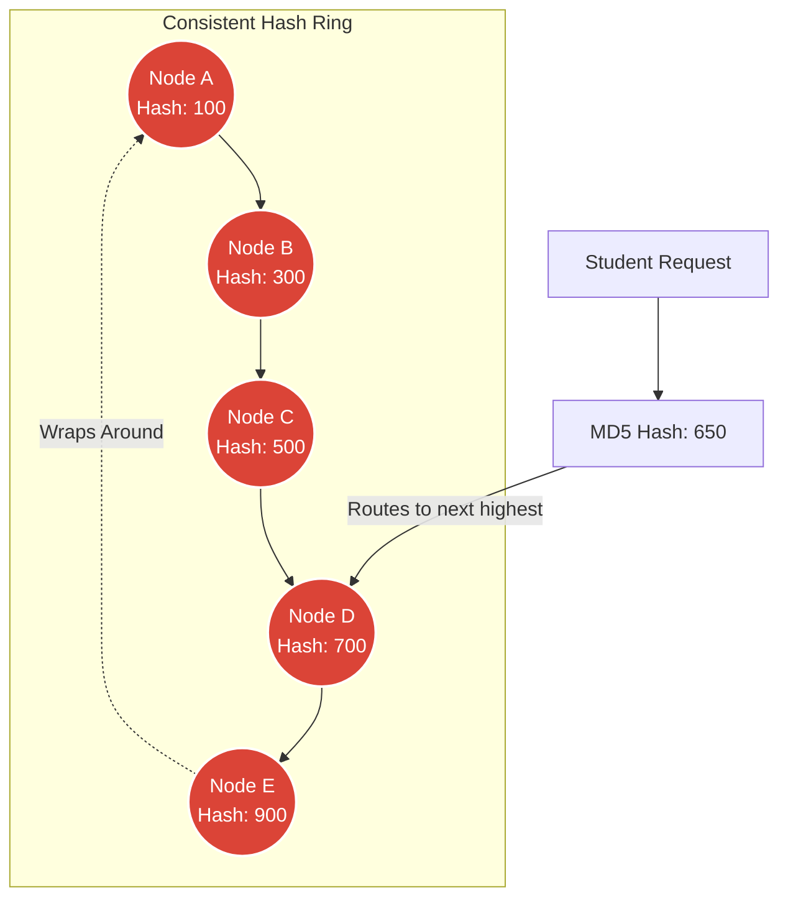
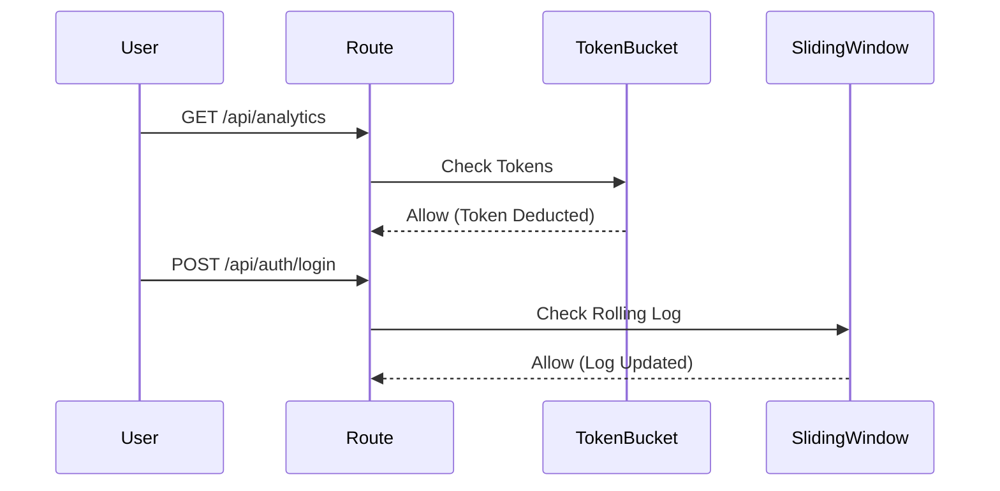
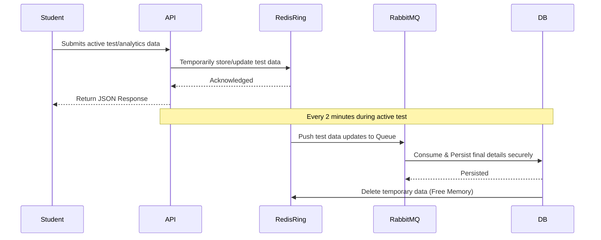
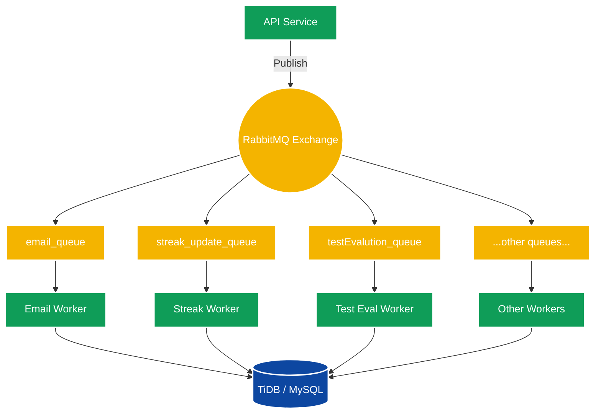
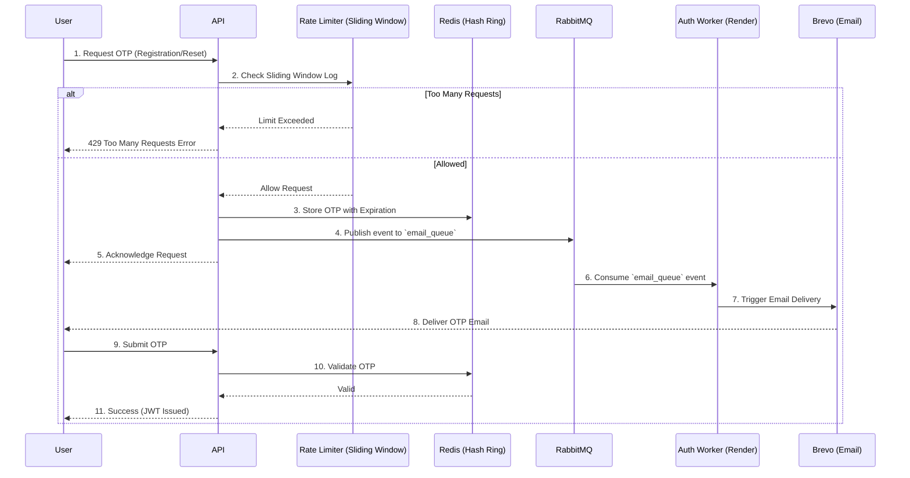

# JEEArchive - Mock Test Platform Backend

**A full-featured JEE mock test platform with a pixel-accurate NTA exam replica, a custom chapterwise test interface, topic-wise PYQ practice, full-length mocks, and detailed performance analytics with question-level solution breakdowns.**

[jeearchive.com](https://jeearchive.com) | [Live API (Render)](https://jee-mock-test-backend-5bgg.onrender.com)

---

## 🔒 Repository Notice
**This repository is private** to protect proprietary question-bank infrastructure, exam-engine logic, and analytics pipelines. The codebase powers a live mock-test platform with an active beta user base.

**Recruiters and collaborators:** I am happy to grant private repo access or walk you through the codebase on a call. Reach me at [tanishqjain1109@gmail.com](mailto:tanishqjain1109@gmail.com).

---

## 📊 Platform Stats
| Metric | Value |
|--------|-------|
| **Beta Users Onboarded** | 1,000+ |
| **Question Bank Size** | 16,484+ questions |
| **REST API Endpoints** | 50+ |
| **Subjects Covered** | Physics, Chemistry, Mathematics |
| **Test Modes** | NTA Replica, Chapterwise, Topic-wise PYQ, Chapterwise PYQ, Full-length Mock |

---

## 🛠️ Backend Tech Stack
| Layer | Technology & Provider |
|--------|-------|
| **Core Environment** | Node.js, Express.js, TypeScript |
| **Database & ORM** | TiDB (MySQL), Prisma ORM |
| **Caching & In-Memory** | Aiven Valkey (Single Cache & Hash Ring), Redis Cloud (Bitmaps) |
| **Message Broker** | RabbitMQ via CloudAMQP |
| **Storage & CDN** | Backblaze B2, Cloudflare |
| **Secrets Management** | Doppler (Env Injection) |
| **Email Service** | Brevo |
| **Authentication** | JWT, Bcrypt, Google OAuth |
| **Deployment** | Render |

---

## 🚀 Features

- **NTA Exam Interface Replica**: Pixel-accurate replication of the NTA exam portal UI, matched in layout, color scheme, and interaction patterns. Timed paper flow behaving exactly like the live exam.
- **Custom Chapterwise Test Interface**: A separate, purpose-built interface designed for focused, distraction-free practice on a single chapter at a time.
- **PYQ Practice**: Chapterwise and Topic-wise PYQs covering every chapter across Physics, Chemistry, and Mathematics. Full-length mock tests replicating actual JEE patterns.
- **Review and Submission**: Auto-save of responses to prevent data loss mid-test. Detailed post-submission breakdown of answers.
- **Detailed Analytics Section**: Chapterwise score visualization, accuracy trend charts, weak-area breakdowns, and per-session performance history.
- **Solution Breakdown**: Full, step-by-step solutions available for every question attempted.

---

## 📸 Features Overview & UI Screenshots

### NTA Exam Interface Replica

### Custom Chapterwise Test Interface

### Topic-wise and Chapterwise PYQ Practice

### Performance Analytics Dashboard

### Solution Breakdown View

### DashBoard

---

## 🏗️ Backend System Architecture

> 💡 **Zero-Cost & High-Scale Architecture**: The entire backend infrastructure—including the Node.js API, TiDB database, Redis caching, RabbitMQ message queues, and CDN file storage—is heavily optimized and engineered to run **completely within the free tier** of its respective cloud providers while easily **handling up to 10,000+ concurrent users**.

This backend follows a standard Service-Repository pattern, decoupling business logic from data access. It is designed to be highly scalable, performant, and cost-effective.

*Note: The system utilizes two distinct Redis architectures. A **Single Redis Cache** is used for read-heavy static data (like Chapter Data and PYQ metadata); if a cache miss occurs here, the Core Services query the Database directly. Meanwhile, a **Redis Hash Ring** is used exclusively for temporary, write-heavy session data (like active test data, dashboard analytics, and Auth OTPs) until it is permanently saved. Backblaze B2 is heavily utilized for storing the actual images of the questions. The API returns the JSON Data / URL, and only then does the client hit the Backblaze B2 service (via Cloudflare) to fetch the actual file. Additionally, Core Services also interact with the CDN to fetch these question images when required for internal processing.*

### 2. Consistent Hashing & Redis Clusters (For Temporary Data)
To ensure high availability and load distribution across multiple Redis instances, the system implements a custom **Hash Ring (`HashRingService`)** for Consistent Hashing. This cluster is **strictly used for temporary, volatile data** (like active test sessions, auth OTPs, and real-time dashboard analytics) until it is persisted. 
- **Dual Hash Rings**: The system maintains two separate rings, one for Authentication (`authRing`) and one for Dashboard Caching (`dashboardRing`).
- **Deterministic Routing**: When a user requests data, their `userId` is hashed using MD5 to route to the nearest node.
- **Node Rebalancing & Dynamic Scaling**: The hash ring allows for the dynamic addition or removal of Redis nodes on the fly. If the system experiences high load, new Redis nodes can be spun up and added to the ring for horizontal scaling without downtime. The system mathematically drains existing hash values and distributes them to the new nodes seamlessly.

### 3. Rate Limiting Strategies
Two distinct algorithms are implemented based on route sensitivity:
1. **Token Bucket Algorithm**: Standard API endpoints (Analytics, Banners). Tokens refilled at a constant rate.
2. **Sliding Window Log Algorithm**: Sensitive Auth routes (OTP, Login). Keeps a rolling timestamp log to strictly prevent brute-force attacks.

### 4. Redis Bitmap & Hashing Structure
For ultra-fast, memory-efficient data tracking, the system utilizes **Redis Bitmaps (Bitfields)**. 

Tracking which questions a student has attempted across thousands of questions can be database-heavy. Instead:
- A `questionBitmap:indexMap` (Redis Hash) maps every `questionId` to a specific bit index (0, 1, 2...).
- When a student attempts a question, their personal **Redis Bitmap** flips the bit at that specific index from `0` to `1`.
- Retrieving all attempted questions for a student becomes an incredibly fast bitwise operation rather than an expensive SQL `JOIN` or `SELECT`.

### 5. In-Memory Data Flow & Caching Strategies
To reduce database bottleneck during ongoing tests, the two Redis architectures split the load:
- **Heavy Read Caching (Single Redis)**: Static data like Question Banks, Chapter Data, and Year-wise Papers are heavily cached in a single Redis instance. On a cache miss, the DB is queried.
- **Write-Heavy Operations (Hash Ring)**: Live analytics, OTPs, and active test statuses are primarily written to the Redis Hash Ring.
- **2-Minute Sync via RabbitMQ**: During the test time, updates occur every **2 minutes**. The data flows from the Redis Hash Ring, gets pushed to a RabbitMQ queue, and is then consumed and saved into the primary database.
- **Cleanup**: Once securely persisted, the database workflow explicitly deletes the temporary data from the Hash Ring to free up memory.

### 6. Message Queues & Background Workers
Heavy tasks are offloaded to **RabbitMQ**.
- **Queues Utilized**: `email_queue`, `emailAdding_queue`, `streak_update_queue`, `studentTestAnalytics_queue`, `submitChapterAttempt_queue`, `testEvalution_queue`, `updateChapterAttempt_queue`, `updateTestDetails_queue`.
- **Producers**: The API services publish messages to specific exchanges.
- **Consumers (Workers)**: Over **7 independent worker processes** are running concurrently on different **Render** services. They consume these messages to perform heavy lifting asynchronously (e.g., parsing 100+ questions for test evaluation).

**Additional Background Services:**
- **Transactional Emails**: Sending OTPs and notifications via `email_queue`.
- **Student Streak Management**: Tracks and updates consecutive days of activity in cache first via the `streak_update_queue`.

### 7. File Storage (Backblaze B2 & Cloudflare)
- **Deployment**: The Node.js/Express backend itself is deployed on **Render** (via free/hobby tiers).
- **Storage**: Files are uploaded directly to **Backblaze B2**.
- **CDN & Caching**: **Cloudflare** is placed *only* in front of Backblaze B2 to serve the static assets. 
- **Free Tier Synergy**: The Bandwidth Alliance ensures data transfer between them is free, drastically reducing direct reads to Backblaze.

### 8. Authentication Flow & Database Pooling
- **Authentication**: Supports traditional email/password login securely hashed with **Bcrypt**, alongside seamless **Google OAuth** integration. Sessions are securely managed using **JSON Web Tokens (JWT)**.
- **OTP Verification Flow**: When a user registers or resets a password, a generated OTP is temporarily stored in the **Redis Hash Ring**. To prevent abuse, OTP requests are strictly rate-limited using the **Sliding Window Log Algorithm**. If the rate limit is passed, an event is published to the `email_queue`. A dedicated background worker on Render consumes this event and emails the OTP to the user via the **Brevo** service. Once the user enters the OTP, the API verifies it instantly against the Hash Ring.

- **Database (TiDB / MySQL)**: Uses **Prisma ORM**. Prisma handles connection pooling out of the box.
- **Query Optimization**: Repositories leverage `findMany` batching, selective `select` statements, and `$transaction` blocks to ensure atomicity.

---

## 👥 Team

This project is built by a team of three:
- **Tanishq Jain** (Backend Developer) - Handles all backend infrastructure, including building the REST API endpoints, question bank architecture, and test session caching.
- **Ayush Singh** (Frontend Developer) - Handles the complete frontend of the platform, including the NTA replica interface, custom chapterwise practice UI, and analytics dashboard.
- **Utkarsh Singh** (User Operations) - Handles everything user-facing outside the product itself, including direct user communication and marketing strategy.

---

## ℹ️ About

**Tanishq Jain (Backend Lead)**  
Handles all backend infrastructure, including the API layer, question bank architecture, test session handling, Redis caching, RabbitMQ workers, and results computation.
- **LinkedIn**: [tanishq-jain-6b90b1292](https://www.linkedin.com/in/tanishq-jain-6b90b1292/)
- **GitHub**: [Tanishq112005](https://github.com/Tanishq112005)
- **Email**: [tanishqjain1109@gmail.com](mailto:tanishqjain1109@gmail.com)

**IIIT Bhagalpur, B.Tech CSE, 2023-2027**

---

## 📜 License

**This project is proprietary and not open source.** 
All rights reserved. The source code is not available for public use, reproduction, or distribution.
